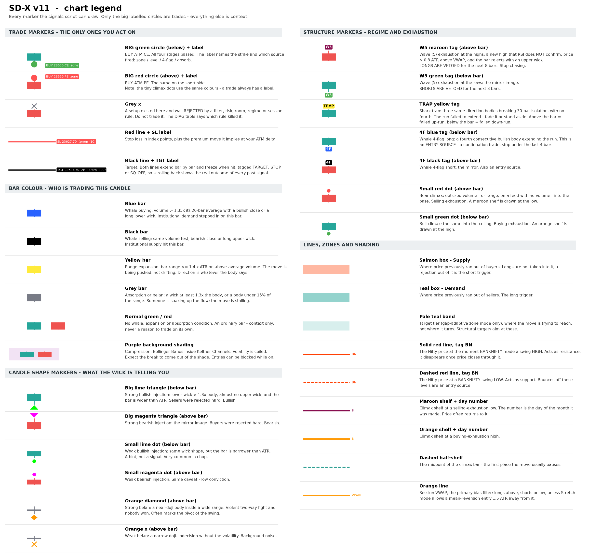

# SD-X v11

Nifty Intraday Signals + Option Chain

*TradingView Pine Script v6 \| User guide*

## 1. What this is

SD-X is a pair of TradingView indicators for intraday Nifty trading on a 3-minute chart, written for an option buyer who takes ATM CE or PE positions and squares off the same day.

It started as a pure mean-reversion system: price rejects a supply or demand zone, or bounces off a level where BankNifty previously turned, and momentum agrees. This version adds a ported **GTI engine** — order-flow reading through bar colour, candle shape, flag runs and climax shelves — which contributes two continuation entry sources of its own and a set of vetoes that stop the reversion trades you should not be taking. It is still deliberately selective: on a strong one-way trend day it will often produce no signals at all.

The package is split into two scripts because TradingView caps a single indicator at 40 unique data requests, and a live option chain uses a new request every time the ATM strike moves.

| **Script** | **What it does** | **History** |
|:---|:---|:---|
| SD-X v11 Signals | Zones, cross-index levels, GTI order-flow markers, filters, entry circles, SL and target lines, statistics and diagnostics. Uses 4 data requests. | Full chart history |
| SD-X v11 OI | Option chain table: strike-wise CE/PE open interest, intraday OI change, PCR, max-OI strikes, writing bias, futures buildup, live ATM premiums. | Last 20 bars only (current snapshot) |

Both are added to the same chart. The signals script is the one that produces trades; the OI script is context you read before and during a trade.

## 2. The chart at a glance

`sdx_legend.png` is the printable version of this table — every marker the script can draw, in the colours it draws them. Regenerate it with `python sdx_legend.py` after changing the script.

The one rule that matters: **only the big circle with a "BUY … CE/PE" label is a trade.** Everything else on the chart is context that tells you what kind of tape you are in.

## 3. Technical indicators used

### 3.1 Supply and demand zones

Two shaded boxes: salmon for supply above price, teal for demand below. They mark where price previously ran out of buyers or sellers. Five construction modes are available.

| **Mode** | **How the zone is built** | **When to use** |
|:---|:---|:---|
| Auto (near price) | Supply = highest high of the last 40 bars down to that level minus one ATR. Demand mirrors it from the lowest low. | Default. The zone slides with price, so it is always reachable — even in a strong trend. |
| Daily gap-adaptive | Built at 09:15 from yesterday's high, low and close against today's open. A gap down makes yesterday's close the cap; a gap up makes it the floor; a flat open uses plain prior-day structure. Also draws pale teal **target tiers**. | Gap days, and whenever you want structural targets instead of a fixed multiple. |
| Previous candle | Yesterday's daily high to its body top (supply); body bottom to its low (demand). | Swing context. Often far from price intraday. |
| Last pivot | The most recent confirmed swing high/low on the zone timeframe. | Range days. Warning: in a sustained trend no new pivot confirms, so the zone can strand hundreds of points away. |
| Range extremes | Highest high / lowest low of the last N bars on the zone timeframe. | A middle ground between Auto and pivots. |

Every zone is at least "Min zone height" points thick (default 15) so a narrow trend candle cannot produce a sliver of a zone.

**Target tiers** (gap-adaptive mode only) are the pale teal bands. They mark where the move is *trying to reach*, not where it turns. Set Target mode to "Structure (gap tiers)" and the script aims at the next tier instead of a fixed R:R — and refuses the trade when there is less than "Min R:R" of room to it.

### 3.2 Cross-index pivot levels

The script watches BankNifty for swing highs and lows using an 8-bar pivot on the chart timeframe. When BankNifty turns, it draws a horizontal line at the Nifty price that existed at that same moment.

The premise is that Nifty is heavily driven by banks, so a turn in BankNifty often leads a turn in Nifty by a few candles. Sensex was dropped in this version: it correlates ~0.99 with Nifty on near-identical constituents, so its pivots landed on Nifty's own and added clutter rather than information.

| **Element** | **Meaning** |
|:---|:---|
| Solid red line | Drawn at a pivot HIGH of BankNifty — acts as resistance |
| Dashed red line | Drawn at a pivot LOW of BankNifty — acts as support |
| Tag `BN` | Which index produced it |
| Line disappears | Price closed through it, so it is no longer valid. Only untested levels remain on the chart. |

### 3.3 VWAP — the primary bias filter

Session VWAP on HLC3, the institutional average price for the day. This is the single most restrictive filter in the system, and the usual reason a setup does not become a signal.

| **VWAP mode** | **Effect** |
|:---|:---|
| Trend | Longs only above VWAP, shorts only below. Strictest. On a day where price stays below VWAP from open to close, no long can ever fire. |
| Stretch (default) | As above, plus it permits a counter-trend entry when price is more than 1.5 ATR away from VWAP and RSI is turning back. This is a genuine mean-reversion condition, not simply switching the filter off. |
| Off | No VWAP condition. Not recommended — it allows buying every falling knife. |

### 3.4 RSI and EMA

- RSI (14): longs need RSI above 50, shorts below 50. In Stretch mode a long is also allowed when RSI is under 40 but rising, and a short when RSI is over 60 but falling — the classic oversold/overbought turn.

- EMA (21): optional and off by default. Turn it on when you want to trade only in the direction of the short-term trend; it makes the system considerably quieter.

### 3.5 ATR (14)

Not a filter but the measuring stick used throughout: zone thickness, the stop-loss buffer beyond structure, the "stretch" distance from VWAP, range-expansion and climax tests, and the zone-distance warning in the diagnostic table are all expressed in ATR so the script adapts to quiet and volatile days without changing settings.

### 3.6 The GTI engine — order flow read off the bar

This is what the coloured candles and the small markers are. None of it fires a trade on its own except where noted; it tells you *who* is trading and *what kind of day* you are in.

| **Component** | **What it measures** | **Where it shows** |
|:---|:---|:---|
| Whale bars | Volume above 1.35× its 20-bar average, with a directional close or a long wick | Blue bar = buying, black bar = selling |
| Range expansion | Bar range ≥ 1.4 × ATR on above-average volume | Yellow bar |
| Absorption / belan | Wick ≥ 1.3× body, or body under 15% of range | Grey bar |
| Compression (squeeze) | Bollinger Bands inside Keltner Channels | Purple background shading |
| Injection candles | Long wick against the body — rejection | Lime / magenta triangles (wide bar) or dots (narrow bar) |
| Belan candles | Near-doji inside a range | Orange diamond (wide) or orange ✕ (narrow) |
| Shark trap | Three same-direction bodies breaking 30-bar isolation, with no fourth | Yellow `TRAP` tag |
| Whale 4-flag | A fourth consecutive body extends the run | Blue `4F` (long) / black `4F` (short) — **an entry source** |
| Absorption at base/ceiling | Absorption wick at the day's structural edge, on the right side of VWAP | Contributes an `absorb` entry — **an entry source** |
| Climax | Outsized volume (or range) into the base or ceiling | Small red / green dot, plus a shelf line |
| Climax shelves | Horizontal memory of a climax bar, tagged with the day of month, with a dashed half-range line | Maroon (low) / orange (high) |
| CAMDC phase | Where the day sits in Compression → Accumulation → Manipulation → Distribution → Correction | "Phase" row of the Today table |

**A note on volume.** A spot index reports no traded volume, so every volume gate would silently pass or silently fail depending on your feed. The "Volume confirmation" setting defaults to **Auto**: it uses volume where the feed provides it and degrades to price-only tests where it does not. When it degrades, the Phase row is marked `(no vol)` and the whale bar colours stop appearing — the signals get looser, not wrong.

### 3.7 Wave (5) exhaustion — the veto

The most important addition in this version, because it stops trades rather than starting them.

A `W5` tag is printed when price makes a new extreme that RSI does **not** confirm, while stretched more than 0.8 ATR from VWAP, and the bar rejects itself with a wick larger than its body.

- Maroon `W5` above the bar = exhaustion at the highs. **Longs are vetoed for the next 8 bars.**
- Green `W5` below the bar = exhaustion at the lows. **Shorts are vetoed for the next 8 bars.**

These vetoes are counted in the "Blocked: W5 / squeeze" row of DIAG, so you can see exactly what they cost you.

### 3.8 India VIX regime

A daily India VIX read drives the "Regime" row of the Today table, and is advice only — it changes no logic.

| **VIX** | **Regime** | **Strike advice** |
|:---|:---|:---|
| Below 13 | Low — rangebound | ATM / slight OTM |
| 13 to 18 | Moderate — trending | ATM / slight ITM |
| Above 18 | High — vega crush | ITM (vega shield) |

The point is that in a high-VIX session an OTM option can lose money on a correct directional call, because implied volatility collapses faster than delta pays. Going ITM trades premium cost for a smaller vega exposure.

### 3.9 Open interest (companion script)

OI is the number of contracts outstanding at each strike. Rising call OI means fresh call writing, which builds resistance; rising put OI means put writing, which builds support. The table reads the chain around ATM and summarises the day.

| **Reading** | **Interpretation** |
|:---|:---|
| CE Δ positive (red) | Call writing at that strike — sellers expect price to stay below it |
| PE Δ positive (green) | Put writing — sellers expect price to hold above it |
| Res / Sup | Strike with the highest total CE / PE open interest |
| CE wr / PE wr | Strike where the most OI was ADDED today. Usually more relevant intraday than total OI. |
| PCR | Put-call ratio of total OI. Above 1.2 leans bullish, below 0.8 bearish. A blunt measure — use it as background, not a trigger. |
| Buildup | Futures OI change against the day's price move: long buildup, short buildup, short covering, or long unwinding. |

If your TradingView plan has no NSE F&O OI entitlement, `oi_chain.py` prints the same table from NSE's public endpoint, and `oi_desktop.py` keeps it on screen.

## 4. How a signal is produced

Every bar passes through six stages. A setup must survive all of them to become a circle on the chart. The diagnostic table counts how many setups die at each stage, which is what makes the system debuggable.

| **Stage** | **Condition** | **Failure shown as** |
|:---|:---|:---|
| 1\. Trigger | Any of the four entry sources fires (see below). | No setup — nothing plotted |
| 2\. Filter | VWAP mode satisfied, RSI on the correct side, EMA if enabled. | Blocked: filter |
| 3\. Risk | Stop distance is at least 20 points and no more than 70. Wider setups are skipped rather than sized badly. | Blocked: risk |
| 4\. Room | Structural-target mode only: at least "Min R:R" of clear space to the next tier. | Blocked: no room |
| 5\. Regime | Not inside a Wave (5) lockout; not compressed, if you chose to block entries while compressed. | Blocked: W5 / squeeze |
| 6\. Gate | Inside the entry window, under the daily trade limit, no open position, past the cooldown. | Blocked: session/limit |

Stages 2 to 6 mark the bar with a small grey ✕ so you can see, on the chart, exactly where a setup existed and was rejected.

### The four entry sources

Each carries its own stop anchor, and the source is printed on the entry label so you always know which one fired.

| **Source** | **Trigger** | **Stop anchored at** | **Type** |
|:---|:---|:---|:---|
| `zone` | Price wicks into a zone and closes back out with a candle in the right direction | Far edge of the zone | Reversion |
| `level` | Price bounces off an unbroken BankNifty cross-index level | The level | Reversion |
| `4-flag` | A fourth consecutive same-direction body extends an isolated run | Extreme of the last 4 bars | Continuation |
| `absorb` | Absorption wick at the day's base or ceiling, on the right side of VWAP | The bar's own extreme | Reversion |

When more than one fires on the same bar the tightest structural stop wins. Any source can be switched off individually under "Entry sources".

### Entry, stop and target

- Green circle below the bar = buy ATM CE. Red circle above the bar = buy ATM PE. A label names the strike and the source, for example "BUY 23650 CE  zone".

- Red line = stop loss, placed beyond the structure that was defended, plus half an ATR, then floored at 20 points and capped at 70.

- Black line = target: twice the risk by default, or the next structural tier in "Structure (gap tiers)" mode.

- The SL and target labels also show the expected premium move, calculated from the ATM delta setting. A 30-point index stop at 0.5 delta shows as "prem −15".

- Lines extend bar by bar and freeze when hit, tagged TARGET, STOP or SQ-OFF, so scrolling back shows the real outcome of every past signal.

- A bar that spans both stop and target is treated as a stop. Intrabar order is unknowable on a 3-minute candle, so the script never awards itself the gift.

## 5. Intraday rules built into the script

| **Rule** | **Default** | **Why** |
|:---|:---|:---|
| Entry window | 09:20 – 15:00 | Avoids the opening auction noise and gives a late trade room to work |
| Expiry-day entry cut-off | 13:00 | Premium decay and gamma make afternoon expiry entries unsuitable for a 3-minute reversion system |
| Square-off | 15:15 – 15:30 | Every position is closed; nothing is carried overnight |
| Max trades per day | 3 | Prevents revenge-trading a bad session |
| Cooldown | 6 bars | Stops clustered signals in the same move |
| One position at a time | Enforced | No pyramiding, no hedging confusion |
| Wave (5) lockout | 8 bars | Stops you buying the top of an exhausted leg |
| Levels cleared each morning | On | Yesterday's BankNifty pivots do not leak into today |

## 6. Reading the two tables

### Today (top right)

Trades taken versus the daily limit, wins, losses, net index points, an estimated rupee figure using your lot size, and the current ATM strike. On expiry day the ATM cell is flagged in red. Below that:

| **Row** | **What it tells you** |
|:---|:---|
| VIX | India VIX, coloured green / orange / red by regime |
| Regime | Regime name and the strike selection it implies |
| Phase | The current CAMDC phase. `(no vol)` means the feed has no volume and the engine is running price-only. |

The Phase row is the fastest read on the chart. **1 Compression** and **2 Accumulation** are the phases where reversion entries work; **4 Distribution** is where the 4-flag continuation entries live; **3 Manipulation** is where you get stopped out for no reason.

### DIAG (bottom right)

The troubleshooting panel. Read it top to bottom when a day produced no signals.

| **Row** | **What it tells you** | **Action if it looks wrong** |
|:---|:---|:---|
| Zone touched | How many bars entered a zone today | Zero all day means the zone is out of play — check the next row |
| Zone dist (ATR) | How far price is from each zone, in ATR. Turns red beyond 4. | Red means a stranded zone. Switch to "Auto (near price)" mode. |
| Setups found | Triggers that fired before filtering | Zero with touches above means the rejection test is too strict — set rejection to Loose |
| Blocked: filter | Setups killed by VWAP / RSI / EMA | High count on a trend day is usually correct behaviour, not a fault |
| Blocked: risk | Setups needing a stop wider than 70 points | Raise the maximum stop distance if this is persistently high |
| Blocked: no room | Structural target was too close to be worth the risk | Only appears in "Structure (gap tiers)" mode. Lower Min R:R, or switch to Fixed R:R. |
| Blocked: W5 / squeeze | Setups vetoed by a Wave (5) lockout or by compression | If this is high on days you would have won, shorten the lockout or lengthen the wave lookback |
| Blocked: session/limit | Outside the window, or over the trade limit, or in cooldown | Widen the entry window if good setups appear late |
| SIGNALS | What actually fired | — |
| Zone / VWAP / RSI | Live values: the demand zone band, then VWAP and RSI | A sanity check that the filters are seeing what you are |

### Option chain (top left, companion script)

One row per strike around ATM with CE OI, CE change, PE OI and PE change. The ATM row is highlighted and marked with an arrow; the highest-OI CE and PE cells are shaded. Summary rows give totals, PCR, the support and resistance strikes, where today's writing is concentrated, the overall bias, and the futures buildup. The last row shows live ATM CE and PE premiums with the rupee cost of one lot.

## 7. Alerts

Nine alert conditions are exposed. The first three are the ones to actually set:

| **Alert** | **Fires when** |
|:---|:---|
| SD-X Buy CE / Buy PE | A signal circle prints |
| SD-X Square off | An open position reaches the square-off window |
| SD-X Wave 5 top / bottom | Exhaustion — stop chasing that side |
| SD-X Whale 4-flag long / short | A continuation run extends |
| SD-X Absorption at base / ceiling | An absorption wick holds the day's edge |

## 8. Daily workflow

1.  Before the open, glance at the OI table. Note the max-OI call strike (resistance) and put strike (support) — these often bracket the day's range. Check the VIX regime row and pick your strike accordingly.

2.  Read the Phase row through the morning. It tells you which kind of entry the day is likely to offer.

3.  Wait for a circle. Do not anticipate; the filters exist precisely to stop you taking the setups that look obvious but fail. A `W5` tag on your side means stand down for eight bars, no exceptions.

4.  On a green circle, buy the ATM CE named in the label; on a red circle, buy the ATM PE. Note the premium you actually paid, and note the source on the label — a `4-flag` entry is a continuation trade and behaves differently from a `zone` reversion.

5.  Set your stop on the premium: subtract the "prem −" figure from the SL label from your entry premium. Do the same with the "prem +" figure for the target.

6.  Cross-check the OI bias. A long while heavy call writing is being added just above your target is a lower-quality trade; consider taking a smaller size or booking earlier.

7.  Exit at the stop, the target, or 15:15 — whichever comes first. Never carry.

8.  At the close, read the Today and DIAG tables and log the result. After two weeks you will know whether the settings suit your market conditions.

## 9. Troubleshooting

| **Symptom** | **Cause and fix** |
|:---|:---|
| No signals for several days | Read DIAG. Almost always either a stranded zone (use Auto mode), the VWAP filter on trend days (use Stretch mode), or a run of Wave (5) lockouts. Some days genuinely have no valid setup. |
| Zones far above or below price | Pivot-based zones cannot update in a sustained trend because no new pivot confirms. Switch Zone source to "Auto (near price)". |
| No coloured bars at all, Phase says `(no vol)` | Your feed reports no volume for this symbol. Expected on a spot index. The engine has degraded to price-only tests; whale colours cannot be computed. Set Volume confirmation to "Off" to silence the label, or chart the futures instead. |
| "Blocked: W5 / squeeze" is eating everything | Either the day is genuinely exhausted, or the lockout is too long for your timeframe. Shorten Lockout bars, or raise Wave peak lookback so fewer bars qualify. |
| "Blocked: no room" on every setup | You are in structural-target mode with tiers close overhead. Lower Min R:R or switch Target mode to "Fixed R:R". |
| Signals cluster in chop | Raise the cross-index pivot length from 8 to 10 or 12, increase the cooldown, and turn on "Block entries while compressed". |
| Stops feel too tight | Raise the minimum stop distance above 20 points. Nifty 3-minute noise can exceed 20 points in a volatile session. |
| Too many context markers on screen | Turn off "Mark injection / belan candles" and "Mark shark / whale flags" under the GTI group. The entry logic is unaffected. |
| Option chain shows n/a everywhere | The expiry is wrong (check the weekday setting, or use Manual for a holiday-shifted week), or your TradingView plan does not include NSE option OI data. Fall back to `oi_chain.py`. |
| "Too many request calls" error | Reduce "Strikes each side of ATM" to 2 in the companion script. Do not merge the two scripts back into one. |

## 10. Limitations and risk

These points matter more than any setting in this document.

- This is a signal overlay, not a backtested strategy. Results shown on the chart assume a fill at the candle close with no slippage, brokerage or STT. Real option fills will be worse, often by several hundred rupees per lot per round trip.

- The rupee figure in the signals script is an estimate derived from index points multiplied by an assumed 0.5 delta. Actual premium movement depends on delta, implied volatility and time of day, and diverges most on expiry.

- The GTI order-flow read is an interpretation of bar shape and volume, not actual order-book data. On a spot index without volume it is bar shape alone. Treat blue and black bars as a hypothesis about who is trading, not a fact.

- The system is still mean-reverting in the majority of its entries. It will underperform in sustained trends and will produce no signals on some days. That is intended behaviour, not a fault to be tuned away by loosening every filter.

- Cross-index levels are based on an observed tendency, not a mechanical relationship. Correlation between Nifty and BankNifty varies from day to day.

- Option buying carries a high probability of small losses offset by fewer large gains. Position sizing and the daily trade cap matter more to the outcome than signal quality.

- Validate the lot size against the current NSE contract specification before trading — it is entered manually and defaults to 75.

*This document describes a charting tool. It is not investment advice, and nothing in it is a recommendation to buy or sell any instrument. Test on paper before committing capital.*
